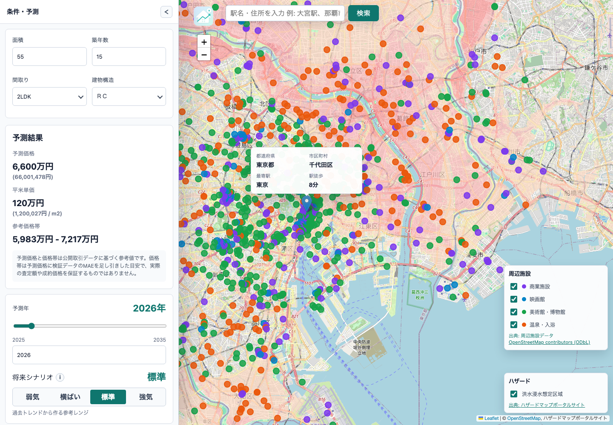
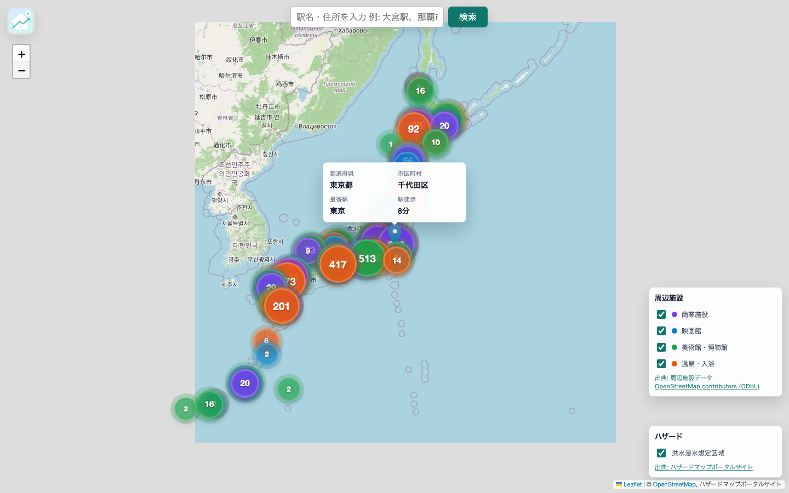
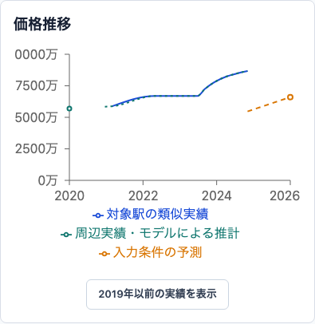
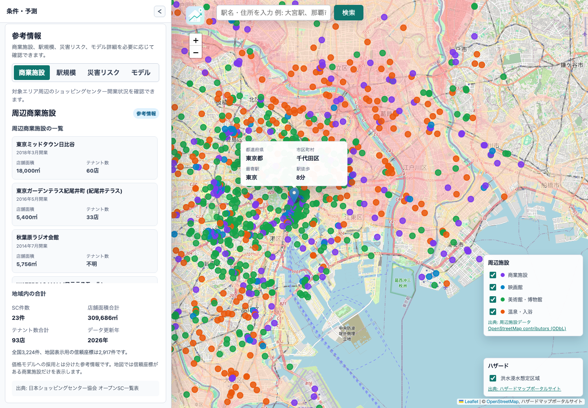
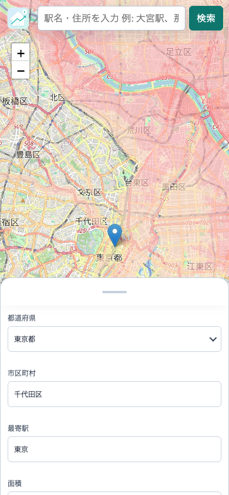

# 不動産価格予測システム

中古マンションの参考価格を、地図と物件条件からブラウザ上で予測するWebアプリケーションです。

地図上で物件位置を選択すると、都道府県、市区町村、最寄駅、駅徒歩を自動補完します。面積、築年数、間取り、建物構造、予測年を変更すると、ブラウザ内のLightGBMモデルが価格を自動で再計算します。

[公開デモを開く](https://kazuki-shimi620.github.io/map-lgb-fond/)



## 主な機能

- 地図クリックによる物件位置の指定
- 住所・駅名検索による地図移動
- 最寄駅と駅徒歩の自動算出
- 面積、築年数、間取り、建物構造を使用した価格予測
- 入力変更に連動した自動再予測
- 予測価格、平米単価、参考価格帯の表示
- 過去価格と将来参考価格のグラフ表示
- 首都圏4都県の専用モデルと8地方モデルによる全国推論
- 全国の商業施設、映画館、美術館・博物館、温泉・入浴施設のカテゴリ別クラスター表示
- 周辺商業施設、駅規模、災害リスク、モデル詳細の参考情報表示
- スマートフォン向けボトムシートUI

## 画面イメージ

### 全国の周辺施設

地図をズームアウトすると、商業施設、映画館、美術館・博物館、温泉・入浴施設をカテゴリ別の件数にまとめて表示します。件数が多いほど円が大きく濃くなり、クリックするとその地域へズームインできます。



### 価格予測結果

入力された物件条件をもとに、予測価格、平米単価、参考価格帯を表示します。


### 価格推移

過去の取引傾向とモデル予測を組み合わせ、対象駅周辺の価格推移を表示します。

将来価格は学習最終年のモデル予測値を基点に、駅別または地域別の価格推移トレンドで補正した参考値です。長期予測の精度は保証しません。



### 周辺施設情報

サイドメニューの参考情報では、周辺商業施設の名称、開業時期、店舗面積、テナント数や地域内の集計を確認できます。駅規模、災害リスク、モデル詳細もタブで切り替えられます。



### スマートフォン表示

スマートフォンでは、地図操作を妨げないよう物件条件と予測結果をボトムシートで表示します。

地図上の位置を選択するとシートが中間位置まで開き、上方向へ展開すると予測結果と価格推移を確認できます。

<p align="center">
  
</p>

## 推論アーキテクチャ

```text
国土交通省 不動産情報ライブラリ
              ↓
       Pythonによる前処理
              ↓
         LightGBM学習
              ↓
          ONNX変換
              ↓
React + ONNX Runtime Web
              ↓
      ブラウザ内で価格推論
```

学習はPythonとLightGBMで実施し、学習済みモデルをONNXへ変換します。

フロントエンドではONNX Runtime Webを使用し、推論APIサーバーを経由せずブラウザ内で価格を計算します。

### ブラウザ推論を採用した理由

- 推論サーバーを運用する必要がない
- GitHub Pagesだけで公開できる
- ランニングコストを抑えられる
- 価格予測がブラウザ内で完結する
- ポートフォリオとして常時公開しやすい

## 技術構成

| 分類 | 技術 |
| --- | --- |
| フロントエンド | React、TypeScript、Vite |
| 地図 | Leaflet、React Leaflet |
| グラフ | Recharts |
| 機械学習 | Python、LightGBM |
| ブラウザ推論 | ONNX、ONNX Runtime Web |
| データ形式 | CSV、ZIP、Parquet、JSON |
| E2Eテスト | Playwright |
| CI/CD | GitHub Actions |
| ホスティング | GitHub Pages |

専門用語は [用語集](docs/glossary.md) で、役割、このアプリでの利用箇所、短い説明例を確認できます。無料機能を維持した収益化の検証方針は [収益化の需要検証](docs/monetization-validation.md) にまとめています。

## ディレクトリ構成

```text
frontend/          React、TypeScript、Vite、Playwright
frontend/public/   ブラウザ配信用ONNX、メタデータ、駅・施設・ハザード・価格推移データ
training/          データ取得、前処理、学習、評価、ONNX出力
training/browser/  公式画面CSVダウンロード用Playwrightスクリプト
docs/              要件定義、実装仕様、テスト仕様、画面画像
```

## セットアップ

```bash
cd frontend
npm install
npm run dev
```

Makefileを使用する場合は次のコマンドでも起動できます。

```bash
make setup
make dev
```

実モデルのONNXが未配置の場合でも、開発用メタデータが用意されている地域ではサンプル予測により画面フローを確認できます。

## GitHub Pages

フロントエンドは `frontend/` をビルドし、GitHub Pagesへデプロイします。

```text
developで開発
        ↓
main向けPull Request
        ↓
フロントエンドビルドおよびPython軽量CI
        ↓
mainへマージ
        ↓
GitHub Actions
        ↓
GitHub Pagesへデプロイ
```

ローカルで本番相当のビルドを確認する場合は、以下を実行します。

```bash
cd frontend
npm ci
npm run build
npm run preview
```

CI/CDの詳細は [docs/cicd.md](docs/cicd.md) を参照してください。

## 学習

```bash
make setup-training
make init-db
make setup-csv-download
make download-csv CSV_PREFECTURES=tokyo CSV_FROM_YEAR=2025 CSV_TO_YEAR=2025
make preprocess-zip REGION=tokyo
make train REGION=tokyo
```

国土交通省の不動産情報ライブラリ公式画面から、中古マンションCSVを取得します。現行モデルで使う最寄駅名と駅徒歩分はAPIレスポンスだけでは揃わないため、学習用の不動産取引データはCSV/ZIPを主入力にします。

商業施設、駅別乗降客数、ハザード情報などの外部特徴量を含む更新手順は [docs/external-data-workflow.md](docs/external-data-workflow.md) を参照してください。

全国47都道府県、2005年から2025年までのCSVを取得する場合は、以下を実行します。

```bash
make download-csv-all
```

地域別モデルをまとめて学習する場合は、以下を実行します。

```bash
make train-all PUBLISH_POLICY=latest
```

利用できるコマンドは以下で確認できます。

```bash
make help
```

## 実装上の工夫

### 学習時と推論時の特徴量整合

LightGBMでは、駅名、自治体、間取り、建物構造などのカテゴリ変数を使用しています。

学習時にカテゴリ辞書とモデルメタデータをJSONとして出力し、フロントエンドの `ModelManager` が同じ順序と同じIDで特徴量を組み立てます。

これにより、Pythonでの学習とブラウザでの推論の変換差異を抑えています。

### 地図と不動産データの連携

地図上で選択された緯度経度に対して、以下の処理を行います。

```text
緯度経度
   ↓
逆ジオコーディング
   ↓
都道府県・市区町村
   ↓
駅マスタとの距離計算
   ↓
最寄駅・駅徒歩
   ↓
価格予測
```

### データクレンジング

国土交通省データの以下の差異を前処理します。

- 文字コード
- 欠損値
- 数値表記
- カテゴリ表記
- 外れ値
- 都道府県および地域区分

前処理は `training/src/preprocess` に分離し、複数年のZIPから地域別Parquetを生成できます。

## E2Eテスト

フロントエンドの主要なユーザー操作は、PlaywrightによるE2Eテストで確認します。

対象となる主な操作は以下です。

- 初期画面と初期値の表示
- モデル読み込み
- 初期価格予測
- 入力変更による自動再予測
- 地図クリックによる物件位置変更
- 住所検索
- 周辺施設のカテゴリ切り替えとクラスター表示
- 価格推移グラフ
- 商業施設、駅規模、災害リスク、モデル詳細の参考情報
- デスクトップ表示
- スマートフォン用ボトムシート
- モデルおよびデータ読み込み失敗時の表示

### テスト実行

```bash
cd frontend
npm run test:e2e
```

UIモードで確認する場合は以下を実行します。

```bash
npm run test:e2e:ui
```

Mobile Safari相当のWebKitテストだけを実行する場合は以下を実行します。

```bash
npm run test:e2e:webkit
```

### README用スクリーンショットの生成

READMEで使用する画面画像は、Playwrightで固定された画面サイズと入力条件を使用して生成します。

```bash
npm run test:e2e:screenshots
```

生成先は以下です。

```text
docs/images/
├── app-desktop.png
├── app-japan-facility-clusters.png
├── app-nearby-facilities.png
├── app-prediction-result.png
├── app-price-history.png
└── app-mobile.png
```

スクリーンショット生成時は、外部ジオコーディングAPIをモックし、実行環境によって画面内容が変化しにくい構成とします。

テストの詳細は [docs/frontend-e2e-test.md](docs/frontend-e2e-test.md) を参照してください。

## AI向け入口

AIエージェントはまず `AGENTS.md` を読んでください。

Codexで再利用する場合は、リポジトリ内skillとして `skills/map-lgb-fond/SKILL.md` も参照します。

GitHub Copilot系の補助には `.github/copilot-instructions.md` を用意しています。

## 注意事項

本システムが表示する価格は、国土交通省の取引データと機械学習モデルを使用した参考値です。

以下の用途を保証するものではありません。

- 不動産鑑定
- 売買価格の保証
- 投資判断
- 金融機関の担保評価
- 将来価格の保証

実際の価格は、物件状態、階数、方角、管理状況、周辺環境、市場状況などによって変動します。
