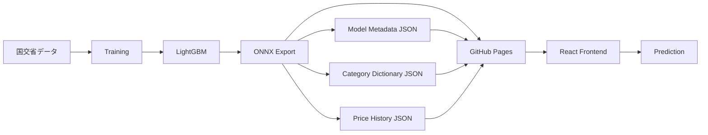
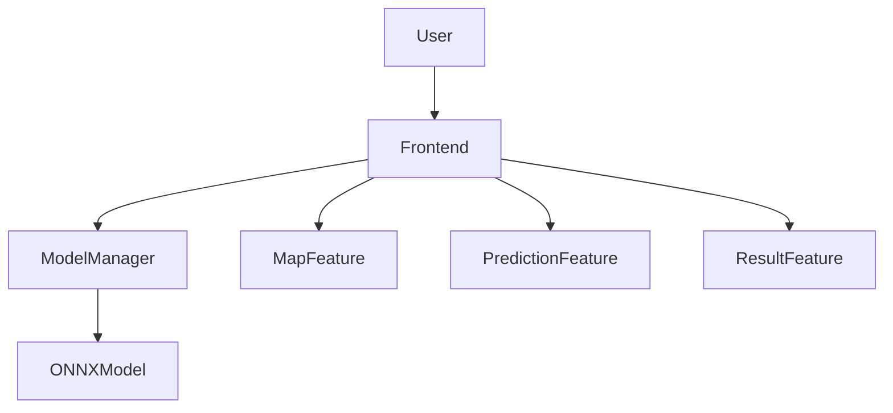
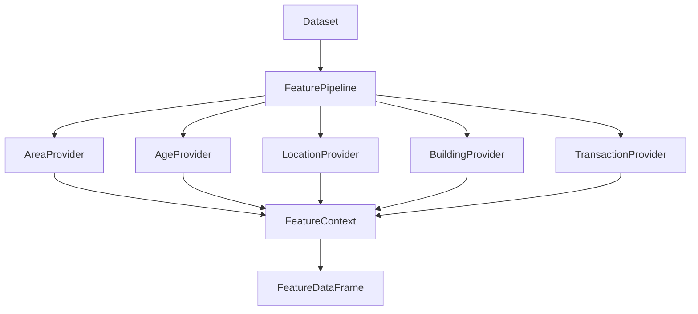
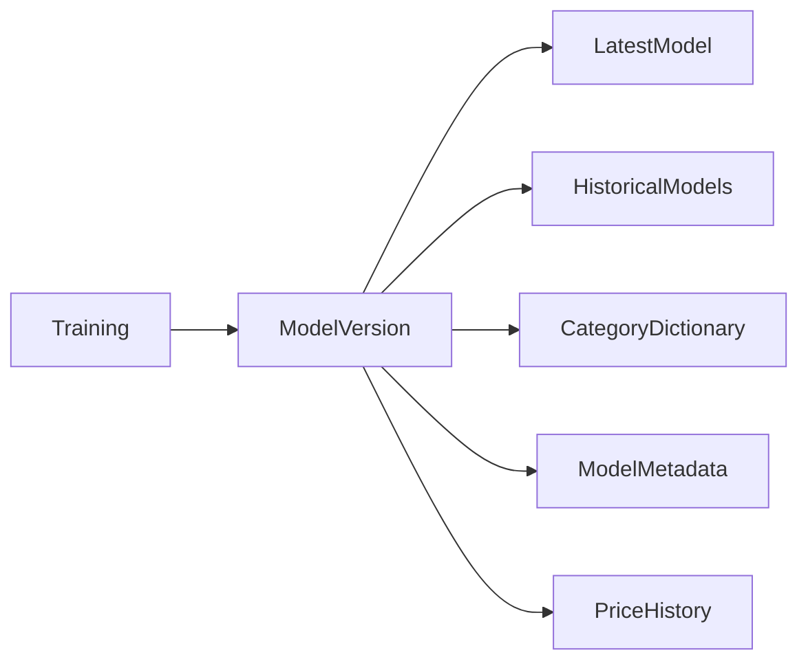
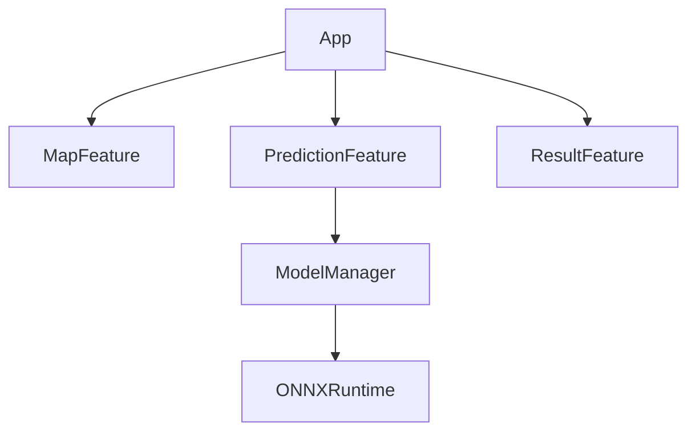

# architecture.md

# システムアーキテクチャ

本ドキュメントはシステム全体の構成およびコンポーネント間の責務を定義する。

---

# 1. アーキテクチャ方針

本システムは以下を重視する。

* シンプルな構成
* サーバーレス推論
* 特徴量追加容易性
* 全国展開への拡張性
* AI実装容易性

---

# 2. システム全体構成



---

# 3. コンポーネント構成



---

# 4. 責務一覧

## Frontend

責務

* ユーザー入力
* 地図表示
* モデルロード
* 推論実行
* 結果表示

保持しないもの

* 学習処理
* モデル生成

---

## Training

責務

* データ収集
* 前処理
* 特徴量生成
* 学習
* 評価
* ONNX出力

---

## SQLite

責務

* 実験管理
* モデル管理
* 特徴量管理

利用用途

* 開発時のみ

推論時は利用しない。

---

# 5. 学習アーキテクチャ


---

# 6. Featureアーキテクチャ

特徴量追加容易性を実現するため
FeatureProviderパターンを採用する。

---

## 構成



---

# 7. FeaturePipeline

責務

* Provider実行
* Provider順序管理
* FeatureContext管理
* DataFrame生成

---

## Provider依存ルール

Provider同士は直接依存してはならない。

禁止例

```text
StationProvider
    ↓
LocationProvider を直接呼ぶ
```

許可

```text
FeatureContext経由
```

---

# 8. FeatureRegistry

Provider登録は明示登録とする。

---

## 理由

* AIが理解しやすい
* 実行順序が明確
* デバッグ容易

---

## 構成例

```text
AreaProvider

AgeProvider

LocationProvider

BuildingProvider

TransactionProvider
```

---

# 9. モデル管理アーキテクチャ



---

## 保存形式

```text
tokyo_latest.onnx

tokyo_20260821.onnx

tokyo_20260821_categories.json

tokyo_20260821_metadata.json

tokyo_20260821_history.json

tokyo_20260830.onnx
```

---

# 10. Frontendアーキテクチャ



---

# 11. Frontendディレクトリ責務

## map

責務

* 地図表示
* 位置選択
* 最寄駅取得

---

## prediction

責務

* 入力フォーム
* PredictionRequest生成

---

## model

責務

* モデルロード
* 推論実行

---

# 12. 推論シーケンス

```mermaid
sequenceDiagram

    actor User

    User->>MapFeature:
    地図クリック

    MapFeature->>PredictionFeature:
    地域情報通知

    User->>PredictionFeature:
    条件入力

    PredictionFeature->>ModelManager:
    PredictionRequest

    ModelManager->>ModelManager:
    文字列入力をカテゴリIDへ変換

    ModelManager->>ONNXRuntime:
    Predict

    ONNXRuntime-->>ModelManager:
    Result

    ModelManager-->>PredictionFeature:
    PredictionResult

    PredictionFeature-->>User:
    結果表示
```

---

# 13. 学習シーケンス

```mermaid
sequenceDiagram

    participant Collect
    participant Preprocess
    participant Feature
    participant Train
    participant Evaluate
    participant Export

    Collect->>Preprocess:
    raw data

    Preprocess->>Feature:
    processed data

    Feature->>Train:
    feature dataframe

    Train->>Evaluate:
    model

    Evaluate->>Export:
    metrics

    Export->>Export:
    カテゴリ辞書JSON生成

    Export->>Export:
    モデルメタデータJSON生成

    Export->>Export:
    価格推移集計JSON生成

    Export->>Export:
    ONNX生成

    Export->>Export:
    frontend/publicへコピー
```

---

# 14. モデルロード戦略

モデルは都道府県単位でロードする。

---

## フロー

```text
東京都選択

↓

tokyo_latest.onnx

↓

推論可能
```

---

## 理由

* 初期ロード高速化
* 将来全国対応しやすい
* モデル分割容易

---

# 15. 地図戦略

MVP

```text
Leaflet

+
外部API
```

---

将来

```text
Leaflet

+
GeoJSON
```

---

目的

* API依存削減
* 完全サーバーレス化

---

# 16. データ追加戦略

新しいデータソース追加時は
FeatureProviderとして実装する。

---

例

```text
CommercialFacilityProvider

PopulationProvider

RailwayProvider
```

---

既存コードの修正は最小限とする。

---

# 17. 全国展開戦略

MVP

```text
東京
埼玉
千葉
神奈川
```

---

将来

```text
全都道府県
```

---

追加作業

* データ取得
* モデル生成
* モデル配置

のみで対応可能な構造とする。

---

# 18. 設計上の非目標

本プロジェクトでは以下を目的としない。

* DDD導入
* マイクロサービス化
* MLOps基盤構築
* Feature Store導入
* Kubernetes運用
* 分散学習

---

# 19. プロジェクト価値

本プロジェクトは高精度予測システムの構築ではなく、

* 機械学習
* 特徴量設計
* システム設計
* 拡張性設計

を実践することを主目的とする。

設計・完成・学習を重視し、
精度のみを追求しない。
